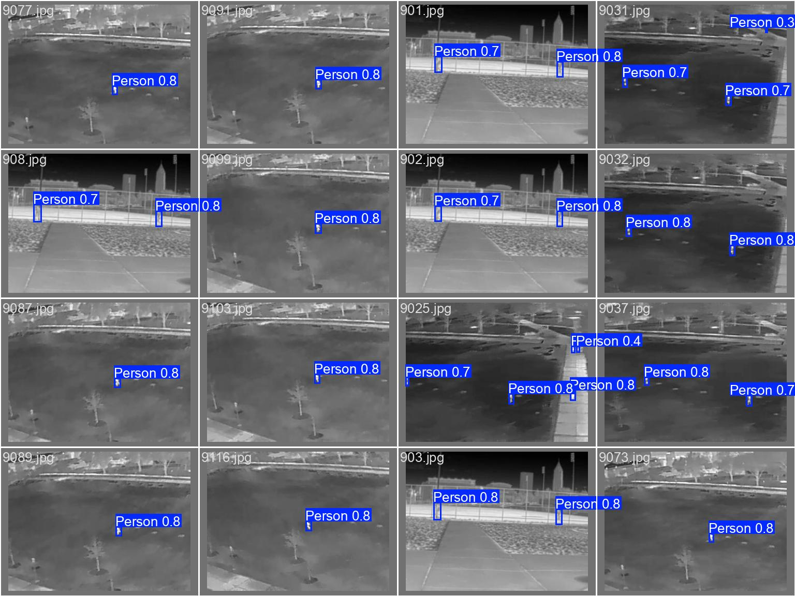

# InfraOD Model

> **Infrared Object Detection with YOLOv11 Nano**

---

## 🚀 Overview

This folder contains the trained YOLOv11 nano model for infrared object detection. The model was trained and tested on **over 35,000 images** from diverse scenarios and camera angles, enabling robust detection of infrared objects.

---

<details>
<summary><strong>📊 Model & Training Details (click to expand)</strong></summary>

- **Model:** YOLOv11 nano (`yolo11n.pt`)
- **Task:** Object Detection
- **Images:** 35,000+ (train/test split)
- **Epochs:** 50
- **Batch Size:** 16
- **Image Size:** 336x336
- **Augmentations:** RandAugment, Mosaic, Flip, Erasing, etc.
- **Framework:** PyTorch
- **Config:** See [`args.yaml`](./args.yaml)

</details>

---

## 🏆 Results & Visualizations

Below are some of the key results and visualizations generated during model evaluation:

| Confusion Matrix | Normalized Confusion Matrix | Results Curve |
|:---:|:---:|:---:|
|  |  |  |

### Sample Predictions

| Validation Batch 0 | Validation Batch 1 | Validation Batch 2 |
|:---:|:---:|:---:|
|  |  |  |

---

<details>
<summary><strong>📈 Training Metrics (click to expand)</strong></summary>

- See [`results.csv`](./results.csv) for detailed epoch-wise metrics (loss, precision, recall, mAP, etc.).
- Example (final epoch):
  - **Precision:** 0.796
  - **Recall:** 0.614
  - **mAP@0.5:** 0.690
  - **mAP@0.5:0.95:** 0.493

</details>

---

## 🧩 Model Weights

- **Best Model:** [`weights/best.pt`](./weights/best.pt)
- **Last Epoch Model:** [`weights/last.pt`](./weights/last.pt)
- **ONNX Export:** [`weights/best.onnx`](./weights/best.onnx)

> **Note:** These files are large. Download as needed for inference or further training.

---

## 🛠️ How to Use

1. **Clone the repository:**
   ```bash
   git clone https://github.com/pranayjoshi/InfraOD.git
   cd InfraOD/InfraOD_model
   ```
2. **Download model weights** (if not present):
   - Place them in the `weights/` directory.
3. **Run inference:**
   - Use your preferred YOLOv11 inference script, specifying the model path (e.g., `weights/best.pt`).

---

## 📚 Credits & References

- [YOLOv11 nano](https://github.com/ultralytics/yolov5)
- [HIT-UAV Infrared Thermal Dataset](https://github.com/suojiashun/HIT-UAV-Infrared-Thermal-Dataset)
- [LLVIP](https://github.com/bupt-ai-cz/LLVIP)
- [Kaggle: Thermal Images for Human Detection](https://www.kaggle.com/datasets/sikdermdsaiful/thermal-images-for-human-detection/data)
- [Original Project Inspiration](https://github.com/vanshksharma/Infrared-Object-Detection?tab=readme-ov-file)

---

> For questions or contributions, please open an issue or pull request! 